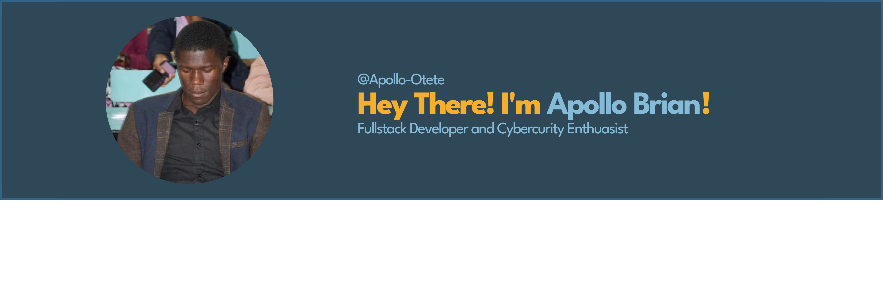

<!-- YOUR BANNER AT THE TOP -->

  

<!-- TYPING ANIMATION -->
<h1 align="center">
  
</h1>

  

  

<!-- YOUR BIO (matches your banner text) -->
## 👨‍💻 About Me

- Fullstack Developer- building web applications
- Cybersecurity Enthusiast- passionate about secure coding
-  Student at **MMUST** - (IT)//Software Engineering & Cyber Security
-  Based in Kakamega, Kenya
- Always learning and solving problem-oriented challenges
- Looking into innovation!

<!-- TECH STACK -->
## 💻 Tech Stack

<!-- GITHUB STATS -->
## 📊 GitHub Stats

  
  

<!-- CONNECT -->
## 📫 Connect

---

⭐️ From [Apollo-otete](https://github.com/Apollo-otete)//+254754995839
